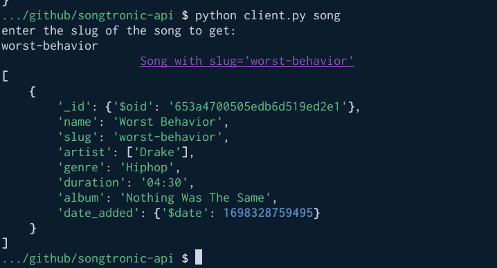

# songtronic-api
API for songs and albums using flask and mongo database

# How to run the app
1. You can run the Makefile
2. create a collection called **songs** in mongodb
    ```
    python main.py
    ```
# How to interact with app
You can use any application similar to **Postman** or **insomia** or that which allows you interact with apis
Or, since I created thi application using my phone. I created the ***client.py*** file that allows me to achieve the same purpose as using **Postman.**
## How to use client.py
1. To add new song
    
2. get all the songs
    
3. delete a song
    
4. Get song with slug
    
5. Search a song
    

